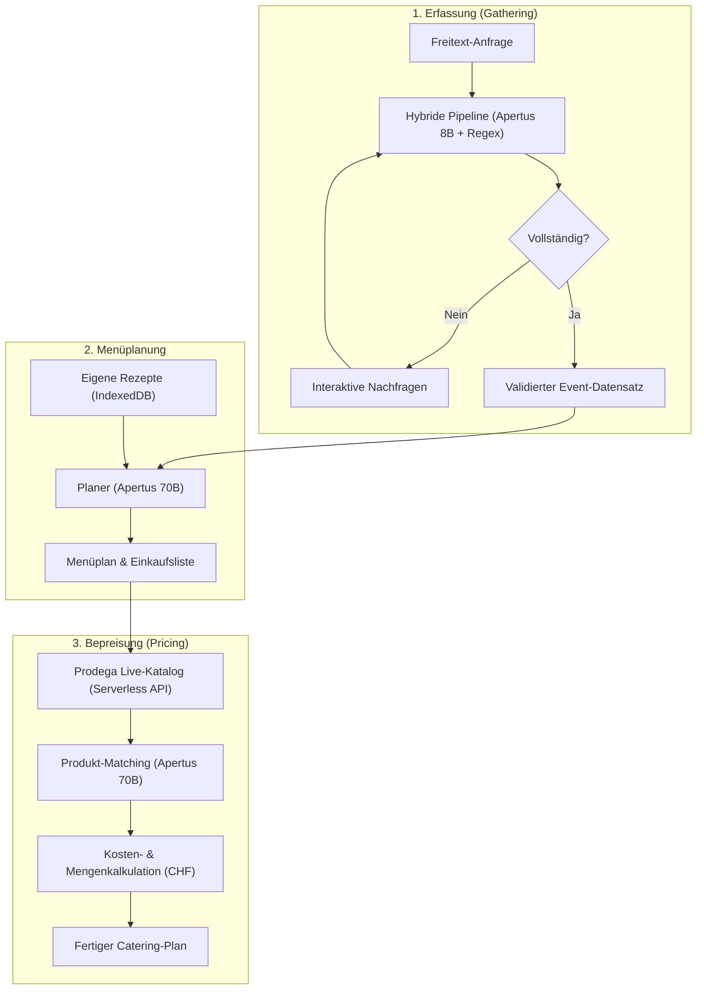

# Technische Informationen für die Jury

## Aktueller Stand des Sourcecodes

### Link zu Github Repository

[https://github.com/fonti17/Byteforce](https://github.com/fonti17/Byteforce)

Das Repository enthält unter `code/` die vollständige Frontend-Applikation inklusive Serverless-Proxy-Routen für den Prodega-Katalog. In den Ordnern `documentation/` und `presentation/` liegen Begleitmaterialien und Präsentationsunterlagen.

## Ausgangslage

### Worauf habt ihr euch fokussiert?

Unser Fokus lag auf «Event in a Box», einem KI-gestützten Catering-Planer, der aus unstrukturierten Freitext-Anfragen automatisch Event-Parameter extrahiert, unvollständige Angaben im Dialog klärt und ein massgeschneidertes Menü samt skalierter Einkaufsliste und Live-Preisen generiert.

Im Entwicklungsprozess haben wir zwei alternative Wege erprobt und verworfen: einen Webscraper für Zutatenpreise auf der Prodega-Website sowie ein klassisches Datenbank-Lookup für vordefinierte Mahlzeiten. Beide Ansätze erwiesen sich als nicht vielversprechend. Ein Webscraper für Prodega-Preise war zu wartungsintensiv und instabil gegenüber direkten API-Katalogabfragen, während statische Mahlzeiten-Datenbanken individuelle Wünsche und Diäten nicht flexibel genug abbilden konnten. Stattdessen kombinieren wir die dynamische Menügenerierung via Sprachmodell mit einer lokalen Rezeptverwaltung.

### Welche technischen Grundsatzentscheide habt ihr gefällt?

Als Sprachmodell nutzen wir Apertus v1.5 (8B und 70B) über Stoney Cloud und onprem.ai. Damit verbleiben alle Daten vollständig und datenschutzkonform in der Schweiz.

Die Anwendungslogik folgt einer Zwei-Phasen-Architektur: Das schnelle 8B-Modell extrahiert in Part 1 die Rahmendaten aus dem Freitext, während das 70B-Modell in Part 2 für die Menü- und Mengenplanung zuständig ist. Die Steuerlogik und Validierung liegen deterministisch im TypeScript-Code, sodass das LLM rein als Extraktor und Inhaltsgenerator agiert.

## Technischer Aufbau

### Welche Komponenten und Frameworks habt ihr verwendet?

| Komponente | Technologie | Version / Quelle |
|---|---|---|
| Frontend Framework | React mit TypeScript | 19.2 / 6.0 |
| Build Tool | Vite | 8.2 |
| UI & Styling | HeroUI, Tailwind CSS | 3.2 / 4.3 |
| KI-Modelle | Apertus v1.5 (8B und 70B) | onprem.ai / Stoney Cloud |
| Katalog-Schnittstelle | Serverless Proxy API | Live-Anbindung an Prodega |
| Persistenz | IndexedDB | Browser-Store für Rezepte |

### Wozu und wie werden diese eingesetzt?

React und HeroUI bilden das Interface der modularen Single-Page-Applikation. Das Apertus 8B Modell extrahiert strukturierte Parameter wie Datum, Gästezahl und Budget aus Freitexten. Apertus 70B generiert basierend darauf Menüvorschläge und Einkaufslisten und übernimmt das Produkt-Matching im Prodega-Katalog.

Über eine Serverless-Route werden passende Prodega-Artikel abgefragt, woraufhin Apertus 70B die optimalen Gebindegrössen für jede Zutat auswählt. Die finale Mengen- und Kostenberechnung in CHF erfolgt deterministisch im Code. Benutzereigene Rezepte werden direkt im Browser in IndexedDB abgelegt.

## Implementation

### Gibt es etwas Spezielles, was ihr zur Implementation erwähnen wollt?

Ein spannendes Detail ist die strikte Aufgabenteilung zwischen qualitativer KI-Entscheidung und deterministischer Arithmetik: Bei Zutaten wie Hackfleisch muss zwischen einem günstigen 5-kg-Gastronomie-Gebinde und handlicheren 1-kg-Packungen abgewogen werden. Das Sprachmodell bewertet hierbei qualitativ das Risiko für Food Waste gegenüber dem Kilopreis. Sämtliche mathematischen Berechnungen zu Packungsanzahl, Portionskosten und Restmengen übernimmt jedoch der Code, um Rechenfehler und Verwechslungen von Innen- und Aussenverpackungen durch das LLM auszuschliessen.

Zudem setzen wir auf eine effiziente Parallelisierung: Um Wartezeiten bei langen Einkaufslisten zu minimieren, werden Produktkandidaten in einem einzigen Batch-Aufruf aus dem Katalog geladen. Das anschliessende Matching durch Apertus 70B wird parallelisiert mit einer Concurrency von 4 abgearbeitet, wodurch langsame Einzelanfragen den Gesamtprozess nicht blockieren.

### Was ist aus technischer Sicht besonders cool an eurer Lösung?

Hervorzuheben ist der nahtlose «Paste an email»-Workflow, der unformatierte Kunden-E-Mails direkt in strukturierte Event-Daten überführt.

Die Verknüpfung von generativer Menüplanung mit echten Prodega-Katalogdaten schlägt die Brücke zwischen kreativer Konzeption und realer Beschaffung. Die KI trifft fundierte Produktentscheidungen bezüglich Packungsgrössen, während die exakte Kosten- und Restmengenrechnung mathematisch präzise im Code durchgeführt wird.

## Abgrenzung / Offene Punkte

### Welche Abgrenzungen habt ihr bewusst vorgenommen und damit nicht implementiert? Weshalb?

Verworfene Ansätze: Der Prodega-Webscraper für Preise und das Datenbank-Lookup für Mahlzeiten wurden zugunsten der direkten Live-API und der flexiblen LLM-Generierung nicht weiterverfolgt.

Scope-Entscheide: Auf Benutzer-Logins und eine zentrale Server-Datenbank wurde verzichtet, da die lokale Browser-Speicherung für den aktuellen Anwendungsfall ausreicht. Der Planer konzentriert sich rein auf Speisen, Getränke und Mengenkalkulation; organisatorische Bereiche wie Raummiete, Dekoration oder Personalplanung wurden bewusst ausgeklammert.
